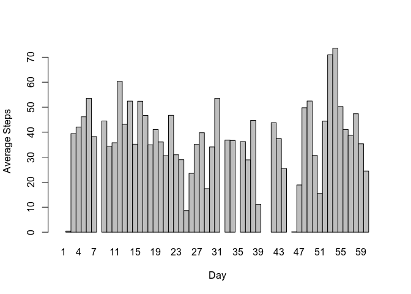
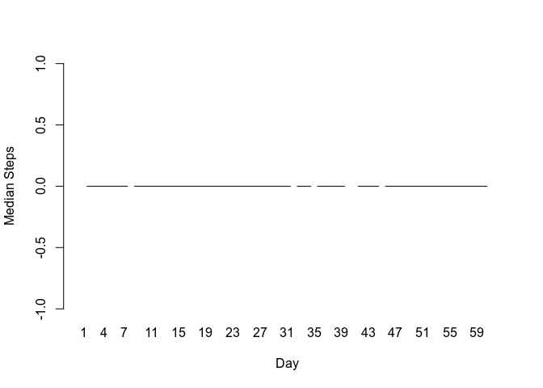
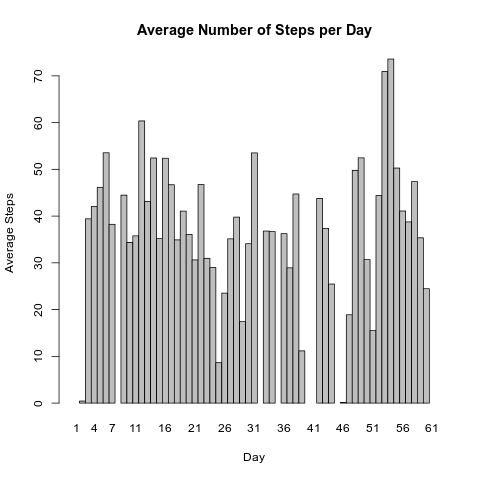

```
{r setup, include=FALSE} knitr::opts_chunk$set(echo = TRUE)
```
# Introduction {.unnumbered}

*Excerpts from the [original
repo](https://github.com/rdpeng/RepData_PeerAssessment1) from which this
was forked*

It is now possible to collect a large amount of data about personal
movement using activity monitoring devices such as a
[Fitbit](http://www.fitbit.com), [Nike
Fuelband](http://www.nike.com/us/en_us/c/nikeplus-fuelband), or [Jawbone
Up](https://jawbone.com/up). These type of devices are part of the
"quantified self" movement -- a group of enthusiasts who take
measurements about themselves regularly to improve their health, to find
patterns in their behavior, or because they are tech geeks. But these
data remain under-utilized both because the raw data are hard to obtain
and there is a lack of statistical methods and software for processing
and interpreting the data.

This project makes use of data from a personal activity monitoring
device which collects data at five-minute intervals through out the day.

The data consists of two months of data from an anonymous individual
collected during the months of October and November, 2012 and include
the number of steps taken in five-minute intervals each day.

+---------------+-----------------------------------------------------+
| Variable name | Description                                         |
+===============+=====================================================+
| steps         | Number of steps taking in a five-minute interval    |
|               | (missing values are coded as `NA`)                |
+---------------+-----------------------------------------------------+
| date          | The date on which the measurement was taken, in     |
|               | YYYY-MM-DD format                                   |
+---------------+-----------------------------------------------------+
| interval      | Identifier for the five-minute interval in which    |
|               | measurement was taken                               |
+---------------+-----------------------------------------------------+

The following are the questions to be addressed:

-   What is mean total number of steps taken per day?

-   What is the average daily activity pattern?

-   Are there differences in activity patterns between weekdays and
    weekends?

# Boring admin stuff

## Install the needed libraries


```r
if (!require("ggplot2")) {
    message("Installing ggplot2")
    install.packages("ggplot2")
}
```

```
## Loading required package: ggplot2
```

```r
if (!require("knitr")) {
  message("Installing knitr")
  install.packages("knitr")
}
```

```
## Loading required package: knitr
```

```r
if (!require("scales")) {
  message("Installing scales")
  install.packages("scales")
}
```

```
## Loading required package: scales
```

```r
if (!require("numform")) {
  message("Installing numform")
  install.packages("numform")
}
```

```
## Loading required package: numform
```

```r
if (!require("timeDate")) {
  message("Installing timeDate")
  install.packages("timeDate")
}
```

```
## Loading required package: timeDate
```

```r
if (!require("dplyr")) {
  message("Installing dplyr")
  install.packages("dplyr")
}
```

```
## Loading required package: dplyr
```

```
## 
## Attaching package: 'dplyr'
```

```
## The following object is masked from 'package:numform':
## 
##     collapse
```

```
## The following objects are masked from 'package:stats':
## 
##     filter, lag
```

```
## The following objects are masked from 'package:base':
## 
##     intersect, setdiff, setequal, union
```

## Download the zipped dataset if not yet present


```r
if (!file.exists("activity.zip")) {
          message("Downloading dataset")
          download.file("https://d396qusza40orc.cloudfront.net/repdata%2Fdata%2Factivity.zip", 
                        destfile = "activity.zip",  
                        method   = "internal", 
                        mode     = "wb")
     }
```

## Unzip the dataset if not yet present


```r
if (!file.exists("activity.csv")) {
          message("Extracting dataset")
          unzip("activity.zip", 
                overwrite = FALSE)
     }
```

## Read in the data

```r
# Shouldn't need error checking here
activity <- read.csv("activity.csv")
```
## Load the libraries

```r
library(ggplot2)
library(knitr)
library(scales)
library(numform)
library(timeDate)
library(dplyr)
```

# Now let's get cooking

## What is mean total number of steps taken per day?
Compute the total number, mean, and median steps per day. Build a `dayStats` dataframe by starting with the aggregate of `steps`, `by = list(date)`, and `FUN = sum`, then merging with aggregates with `FUN = mean` and `FUN = median`.

As an aside, take note of the use of the superassignment (`<<-`) instead of the usual assignment operator (`<-`). This is because the `with(){}` creates its own scope.

```r
with(data = activity,{
     dayStats <<- aggregate(steps, by = list(date), FUN = sum)
     dayStats <<- merge(dayStats, 
                        aggregate(steps, by = list(date), FUN = mean), by = "Group.1")
     dayStats <<- merge(dayStats, 
                        aggregate(steps, by = list(date), FUN = median), by = "Group.1")
})
```
Give the columns meaningful names

```r
colnames(dayStats) <- c("date", "totalSteps", "meanSteps", "medianSteps")
```

Plot total number of steps taken each day, telling `barplot()` to remove spaces between bars. Also, using `(as.Date(date) - as.Date(dayStats[1, 1]) + 1)` as `names.arg` so labels on x axis are day numbers, not the dates. This is so the plot is neater.

```r
with(dayStats,
     barplot(space = 0, totalSteps,
             main  = "Total Number of Steps per Day",
             xlab  = "Day", ylab = "Total Steps", 
             names.arg = (as.Date(date) - as.Date(dayStats[1, 1]) + 1)))
```

<!-- -->

```r
dev.copy(png, "plots/01-totalSteps.png")
```

```
## png 
##   3
```

```r
dev.off()
```

```
## png 
##   2
```

Plot mean of number of steps per day.

```r
with(dayStats, 
     barplot(space = 0, meanSteps, 
             main  = "Average Number of Steps per Day",
             xlab  = "Day", ylab = "Average Steps", 
             names.arg = (as.Date(date) - as.Date(dayStats[1, 1]) + 1)))
```

<!-- -->

```r
dev.copy(png, "plots/02-meanSteps.png")
```

```
## png 
##   3
```

```r
dev.off()
```

```
## png 
##   2
```

And here's the dataframe of average number of steps per day:

```r
knitr::kable(dayStats[, c(1, 3)],
      col.names = c("date", "mean"))
```


|date       |       mean|
|:----------|----------:|
|2012-10-01 |         NA|
|2012-10-02 |  0.4375000|
|2012-10-03 | 39.4166667|
|2012-10-04 | 42.0694444|
|2012-10-05 | 46.1597222|
|2012-10-06 | 53.5416667|
|2012-10-07 | 38.2465278|
|2012-10-08 |         NA|
|2012-10-09 | 44.4826389|
|2012-10-10 | 34.3750000|
|2012-10-11 | 35.7777778|
|2012-10-12 | 60.3541667|
|2012-10-13 | 43.1458333|
|2012-10-14 | 52.4236111|
|2012-10-15 | 35.2048611|
|2012-10-16 | 52.3750000|
|2012-10-17 | 46.7083333|
|2012-10-18 | 34.9166667|
|2012-10-19 | 41.0729167|
|2012-10-20 | 36.0937500|
|2012-10-21 | 30.6284722|
|2012-10-22 | 46.7361111|
|2012-10-23 | 30.9652778|
|2012-10-24 | 29.0104167|
|2012-10-25 |  8.6527778|
|2012-10-26 | 23.5347222|
|2012-10-27 | 35.1354167|
|2012-10-28 | 39.7847222|
|2012-10-29 | 17.4236111|
|2012-10-30 | 34.0937500|
|2012-10-31 | 53.5208333|
|2012-11-01 |         NA|
|2012-11-02 | 36.8055556|
|2012-11-03 | 36.7048611|
|2012-11-04 |         NA|
|2012-11-05 | 36.2465278|
|2012-11-06 | 28.9375000|
|2012-11-07 | 44.7326389|
|2012-11-08 | 11.1770833|
|2012-11-09 |         NA|
|2012-11-10 |         NA|
|2012-11-11 | 43.7777778|
|2012-11-12 | 37.3784722|
|2012-11-13 | 25.4722222|
|2012-11-14 |         NA|
|2012-11-15 |  0.1423611|
|2012-11-16 | 18.8923611|
|2012-11-17 | 49.7881944|
|2012-11-18 | 52.4652778|
|2012-11-19 | 30.6979167|
|2012-11-20 | 15.5277778|
|2012-11-21 | 44.3993056|
|2012-11-22 | 70.9270833|
|2012-11-23 | 73.5902778|
|2012-11-24 | 50.2708333|
|2012-11-25 | 41.0902778|
|2012-11-26 | 38.7569444|
|2012-11-27 | 47.3819444|
|2012-11-28 | 35.3576389|
|2012-11-29 | 24.4687500|
|2012-11-30 |         NA|

The `summary()` function will also give us the mean and median, plus other stats:

```r
knitr::kable(summary(dayStats))
```


|   |        date  |  totalSteps  |  meanSteps     | medianSteps |
|:--|:-------------|:-------------|:---------------|:------------|
|   |2012-10-01: 1 |Min.   :   41 |Min.   : 0.1424 |Min.   :0    |
|   |2012-10-02: 1 |1st Qu.: 8841 |1st Qu.:30.6979 |1st Qu.:0    |
|   |2012-10-03: 1 |Median :10765 |Median :37.3785 |Median :0    |
|   |2012-10-04: 1 |Mean   :10766 |Mean   :37.3826 |Mean   :0    |
|   |2012-10-05: 1 |3rd Qu.:13294 |3rd Qu.:46.1597 |3rd Qu.:0    |
|   |2012-10-06: 1 |Max.   :21194 |Max.   :73.5903 |Max.   :0    |
|   |(Other)   :55 |NA's   :8     |NA's   :8       |NA's   :8    |

`medianSteps` is zero because of the large number of zeroes in that column, mostly from `interval %in% c(0:530)`. `NA`s may also account for that. Since the median is zero, there's no point in drawing a boring plot with a vertical line at `y = 0`, save for blanks for columns with only `NA`s.

## What is the average daily activity pattern?
_Create a dataframe with steps per interval, and plot the line._

Define a function that will take an integer -- in this case, the interval -- and convert it to a `time` string.

```r
int2Time <- function(hhmm) {
     # separate the integer into its minute and hour components
     # assumes an integer of the form hhmm, where hh and mm are the hour
     # (between 0-23) and minute (between 0-59) components, respectively, of the
     # time.
     # Does not do parameter validation
     startHr  <- hhmm %/% 100
     startMin <- hhmm %% 100
     # and put them back together 
     return(paste0(substring(paste0("0", startHr), nchar(startHr)),
                   ":",
                   substring(paste0("0", startMin), nchar(startMin))))
}
```
Since the steps from interval 0 to interval 600 are mostly zero, I'm betting that the measurements start midnight. If they don't, I'm screwed. Or not, maybe just have to make adjustments in the conversions.

What I'm fairly sure of is that the intervals are of the form `hhmm`, where `hh` and `mm` are the hour and minute components, respectively, of the interval. As evidence, let's examine a the subset of `intervalSteps` where the `interval` is an exact multiple of 100 <strong>or</strong> congruent to 55 modulo 100:

```r
knitr::kable(head(subset(activity, interval %% 100 %in% c(0, 55))))
```


|   | steps|date       | interval|
|:--|-----:|:----------|--------:|
|1  |    NA|2012-10-01 |        0|
|12 |    NA|2012-10-01 |       55|
|13 |    NA|2012-10-01 |      100|
|24 |    NA|2012-10-01 |      155|
|25 |    NA|2012-10-01 |      200|
|36 |    NA|2012-10-01 |      255|
Note that two succeeding rows number are congruent to 0 mod 12 and 1 mod 12, respectively. Why 12? Intervals are five minutes apart. One hour is 60 minutes, and sixty divided by 5 is 12. Then, the next row jumps to the next hundred. 

However, the more interesting pattern to look at is `intervalSteps[c(12, 13),]` or, in general, `intervalSteps[x, (x + 1), ]` where `x ⩾ 12 & x mod 12 == 0`. Note that `intervalSteps[c(x, (x + 1)), ]$interval = (i1, i2)`, and `i1` is congruent to 55 mod 100, i2 is congruent to 0 mod 100.

That out of the way, let's get back to the questions at hand.

Average the number of steps over each five-minute interval and plot the time series.

```r
intervalSteps <- aggregate(steps ~ interval, data = activity, mean) %>%
  mutate("time" = as.POSIXct(int2Time(interval), format = "%H:%M", tz = "MST"))

ggplot(intervalSteps, aes(x = time, y = steps)) +
     geom_line() +
     scale_x_datetime(labels = date_format("%H:%M", tz = "MST"), 
                      date_breaks = "2 hours") +
     labs(title = "Time Series Plot of Average Steps Taken Per Day", 
          x = "Time of Day", y = "Average Steps") +
     theme(plot.title = element_text(hjust = 0.5))
```

<!-- -->

```r
dev.copy(png, "plots/04-intervalSteps.png")
```

```
## png 
##   3
```

```r
dev.off()
```

```
## png 
##   2
```

So, from the plot, on average there is negligible activity from midnight to around 5:30 in the morning, slowly climbing at around 7:00, and a spike of over 200 steps at around 8:30.

From then on, there is a minimum of 25 to a maximum of 100 steps, and activity dies down starting close to 11:30 PM.

_Which 5-minute interval, on average across all the days in the dataset, contains the maximum number of steps?_

The starting time and corresponding average number of steps are in `intervalSteps[which.max(intervalSteps$steps), 1]` and `intervalSteps[which.max(intervalSteps$steps), 2]` respectively. I thought I'd include the end time of that interval by adding five minutes.

```r
intervalStart <- intervalSteps[which.max(intervalSteps$steps), 1]
intervalEnd   <- intervalSteps[which.max(intervalSteps$steps), 1] + 5
averageSteps  <- intervalSteps[which.max(intervalSteps$steps), 2]
```

The start and end of the interval will be in 24-hour format.

```r
sprintf("Maximum number of steps on average taken from %s to %s, number of steps = %f",
        int2Time(intervalStart), int2Time(intervalEnd), averageSteps)
```

```
## [1] "Maximum number of steps on average taken from 08:35 to 08:40, number of steps = 206.169811"
```
## Imputing missing values
First question: how many missing values are there?

```r
missing <- is.na(activity$steps)
sprintf("Number of missing steps: %s.", f_comma(sum(missing), mark = ","))
```

```
## [1] "Number of missing steps: 2,304."
```

```r
sprintf("Mean: %s.", mean(missing))
```

```
## [1] "Mean: 0.131147540983607."
```
So, do those 2,304 `NA`s make a difference? Let's find out.

Define a helper function `fillNA`.

+---------------+-----------------------------------------------------+
| Parameter     | Description                                         |
+===============+=====================================================+
| steps         | Cell to be converted, if `NA`, to the average number of steps for `interval` (second parameter)           |
+---------------+-----------------------------------------------------+
| interval      | Identifier for the five-minute interval from which to get the mean number of steps. The function will match  `intervalSteps$interval` with the parameter `interval`, and return the average steps if the `steps` parameter is `NA`                              |
+---------------+-----------------------------------------------------+

```r
fillNA <- function(steps, interval) {
  return(ifelse 
         (!is.na(steps), steps,
           intervalSteps[intervalSteps$interval == interval, "steps"]))
}
```
Make a copy of `activity`, then use `mutate()` to create a `steps` column using `fillNA`. Although the `mutate()` is applied to `activity`, the result is assigned to `adjActivity`, so the former is still intact.

```r
adjActivity <- activity %>%
  mutate(steps = fillNA(steps, interval))
```
Set up the plot, then plot it.

```r
adjSteps <- aggregate(steps ~ date, data = adjActivity, mean)
with(adjSteps, 
     barplot(space = 0, steps, 
             main  = "Average Number of Steps per Day, NA imputed",
             xlab  = "Day", ylab = "Average Steps", 
             names.arg = (as.Date(date) - as.Date(date[1]) + 1)))
```

<!-- -->

```r
dev.copy(png, "plots/05-imputedSteps.png")
```

```
## png 
##   3
```
Compare that with the plot of Average Number of Steps per Day, without imputing `NA`s:

```r

```


Without the imputed data, average steps for days 1, 8, 32, 35, 40, 41, 45, and 61 are zero because of the `NA` steps for those days. Imputing creates data points that look reasonable, consistent in height with the other data points.

Meanwhile, the heights for the other days don't show any appreciable change.

## Are there differences in activity patterns between weekdays and weekends?

Create a new Boolean column that determines whether the day is a weekday or weekend.

```r
adjActivity$is.Weekday <- timeDate::isWeekday(adjActivity$date)
```

Take the mean number of steps per interval broken down into `is.Weekday` and `!is.Weekday`

```r
stepsPerInterval <- aggregate(steps ~ interval + is.Weekday, data = adjActivity, mean)
```

Use the `interval` column to create a `time` column.

```r
stepsPerInterval$time <- as.POSIXct(int2Time(intervalSteps$interval), format = "%H:%M", tz = "MST")
```

Map the `is.Weekday` column to the more readable "Weekend" and "Weekday", then create the plot.

```r
is.Weekday.labs <- as_labeller(c("FALSE" = "Weekend", "TRUE" = "Weekday"))

ggplot(stepsPerInterval, aes(time, steps, col = factor(is.Weekday))) +
  facet_wrap(.~factor(is.Weekday), dir = "v", 
             labeller = is.Weekday.labs) +
  geom_line(show.legend = FALSE) +
  labs(x = "Time of day", y = "Steps") +
  labs(title = "Time Series Plot Comparison of Steps") +
  scale_x_datetime(labels = date_format("%H:%M", tz = "MST"), date_breaks = "2 hours") +
  theme(plot.title = element_text(hjust = 0.5))
```

<!-- -->

```r
dev.copy(png, "plots/06-WkDayVsWkEnd.png")
```

```
## png 
##   4
```
The plot tells us that on both weekends and weekdays, the subject is on average inactive, possibly asleep, from midnight to 5:30 in the morning. However, inactivity on weekends stretches to about 8:00 AM, whereas the subject starts moving about 5:30 AM on weekdays. Activity on both weekends and weekdays spikes at 9:00 AM, although to a lesser extent for the former.

Oddly, activity from 10:00 AM all the way to 5:30 PM is heavier on weekends, then wanes at 11:00 PM for both weekends and weekdays. The subject is probably at a desk, maybe at school or at work, at those times during weekdays, and outdoors, possibly at the mall, on weekends.

# Recreating this PDF or HTML

The YAML of this document instructs `knitr` to produce both a PDF and an HTML. From the command line, you can issue the command:
`R -e "rmarkdown::render('PA1_template.Rmd')"` no matter your Operating System. You can also render it using the RStudio `Knit` button (where's the fun in that?) or the R console, with the command `rmarkdown::render('PA1_template.Rmd')`.

# The environment of this project

This project was created on a Lenovo ThinkPad X201T with 4GB of RAM, running Debian GNU/Linux 10 (buster), R version 3.5.2 (2018-12-20),  RStudio.Version 1.3.1056 Water Lily.
